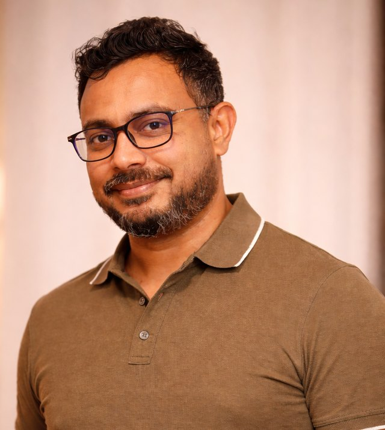

I'm a PhD statistician (Simon Fraser University, 2018) and Associate Professor at the University of the Fraser Valley, working with researchers, teams, and organizations that need statistical work done carefully — from the design stage through to a result that holds up to review. I'm a member of the Statistical Society of Canada, where my P.Stat. (Professional Statistician) application is under review.

::: {.eyebrow}
About
:::

## Who you'd be working with

::: {.about-grid}
{.headshot fig-alt="Ruwan C. Karunanayaka"}

::: {}
I'm an Associate Professor in the Department of Mathematics and Statistics at the University of the Fraser Valley, where I've taught since 2019. I hold a PhD in Statistics from Simon Fraser University (2018), supervised by Boxin Tang and Tim Swartz, an MS in Statistics from Sam Houston State University (2014), and a BSc in Mathematics from the University of Kelaniya, Sri Lanka (2009).

My research runs along two connected lines. In statistical design theory, I develop fractional-factorial and computer-experiment designs under the baseline parameterization, with a focus on efficiency and robustness; current work extends toward space-filling and screening designs. In applied statistics, I work on measurement and prediction in sport, applying generalizability theory and machine learning to large-scale team-performance data. The common thread is measurement you can trust — designing studies so the data can answer the question, and quantifying how reliable the answer is. That thread is exactly what I bring to consulting.
:::
:::

::: {.eyebrow}
Who I work with
:::

## Clients & collaborators

- **Graduate students and faculty** — thesis and dissertation analysis, defence preparation, and grant applications.
- **Health researchers and clinical teams** — study design and analyses that stand up to ethics boards and reviewers.
- **Engineering and manufacturing groups** — designed experiments, quality methods, and process improvement.
- **Sports organizations and performance staff** — measurement, reliability, and forecasting from performance data.
- **AI and product teams** — evaluation design, reliability of judgment pipelines, and calibration audits.

::: {.eyebrow}
Services
:::

## What I help with

::: {.cols-3}
::: {.card-plain}
### Study & experiment design
Sample-size and power calculations, randomization, factorial and fractional-factorial designs — including designs under the baseline parameterization — and design of experiments for product, process, and lab work — so the data you collect can actually answer your question. For funding proposals, this includes grant-application support: sample-size justification, power analysis, and statistical-analysis plans.
:::
::: {.card-plain}
### Modelling & analysis
Mixed-effects and generalized linear models, regression, ANOVA, survival analysis, and measurement reliability (generalizability theory). Validated, documented, and written up for the audience that has to trust it.
:::
::: {.card-plain}
### Tools & dashboards
Reproducible analysis in R, and interactive R / Shiny applications that put your model in front of the people who need to act on it — [live examples here](projects.qmd).
:::
:::

::: {.eyebrow}
AI & machine learning
:::

## Statistics for AI systems

AI has a measurement problem. Benchmark scores move with the evaluation harness, leaderboard gaps often sit inside statistical noise, human and LLM-judge ratings carry biases nobody has quantified, and evaluation experiments are rarely repeated. If your organization is choosing, validating, or shipping AI systems, the statistics underneath those decisions deserve the same rigor as a clinical trial. I offer:

- **Evaluation design & audit.** Design an evaluation that actually answers your question — sampling that matches the deployment population, contamination and leakage control, uncertainty attached to every comparison — or independently audit an existing one before it drives a procurement or launch decision.
- **Reliability of evaluation pipelines.** Human rater panels and LLM-as-judge setups are measurement instruments, and measurement instruments have quantifiable reliability. I decompose where the noise lives, quantify rater and occasion effects, and answer the operational question: *how many judgments before this verdict is dependable?*
- **Benchmark & leaderboard dependability.** Whether a ranking of models — or of anything compared pairwise — reflects real differences or sampling noise, and how much more data a stable ranking would need.
- **Calibration audits.** If your model outputs probabilities or scores that people act on, I test whether they mean what they claim across the ranges that matter.
- **Design of experiments for AI work.** Prompt, configuration, and model comparisons where each run costs real money — factorial and fractional-factorial designs extract far more information per run than one-at-a-time testing.

### What's different about this

Most AI consultants build systems. I do something rarer: I measure whether systems — and the evaluations of them — can be trusted. That comes from a research career in measurement reliability and experimental design, methods proven in peer review rather than assembled from blog posts — including [research under review](research.qmd) on decomposing the uncertainty of AI fairness audits. Two things follow. My conclusions come with honest uncertainty, including "this evaluation cannot support the claim you want to make" when that's the truth. And I'm independent — a university professor with no model, platform, or vendor to sell, which is exactly what third-party validation requires.


## How an engagement works

**Scope.** We start with a conversation about the question, the data you have (or plan to collect), and what a useful answer looks like. If I'm not the right fit, I'll say so quickly and point you somewhere better.

**Design & analysis.** For new studies, design comes first — the cheapest place to fix a study is before the data exist. For existing data, I choose methods to fit the data rather than forcing the data into a familiar method, and I'm explicit about assumptions and their consequences.

**Deliver & document.** You get a clear writeup — methods, results, limitations — in language matched to your audience: a grant reviewer, a regulator, a coach, a journal. Where a number needs to be used repeatedly, I build the tool so your team can run it without me.

::: {.eyebrow}
Track record
:::

## Selected work

**Shot selection in elite handball.** Researchers at the University of Agder wanted to know whether elite handball teams choose their shots well. Working with the group on the statistical analysis of elite match data, the collaboration produced a peer-reviewed study (*International Journal of Sports Science & Coaching*, 2025) documenting systematically suboptimal shot-selection strategies — an evidence base coaches can act on rather than an intuition.

**Making a clinical analysis defensible.** A multi-modal intervention study in frontotemporal dementia needed its analysis to match its design. I advised the team on which analyses the design could actually support — including how to test sex differences within and between groups — so the conclusions claimed no more than the data could bear.

**Statistics that fit the certification.** UFV's Automation & Robotics program needed a statistics course aligned to technologist certification. I advised the design of *Statistics for Electronics* — control charting, acceptance sampling, regression, and experimental design — mapped to what the certification actually examines.

Beyond direct engagements, my design-of-experiments research has been independently cited in applied work across textile engineering, food science, hydrology, and mining — evidence the methods travel.

::: {.eyebrow}
Training
:::

## Workshops for teams

I also run hands-on training for teams and departments: R and reproducible workflows, design of experiments for engineers, data visualization and Shiny dashboards, and statistics for AI evaluation. Sessions scale from a half-day workshop to a multi-day course, built around your data where possible.

::: {.eyebrow}
Common questions
:::

## FAQ

::: {.faq}
**Do you work remotely?** Yes. I'm based in the Fraser Valley, BC, and most engagements run remotely; I regularly work across time zones. In-person is possible locally.

**How are engagements structured?** We start with a short, no-cost conversation about your project. From there, work is scoped either as a fixed-price project with defined deliverables or at an hourly rate for open-ended advising; ongoing arrangements are available for teams that want a statistician on call.

**Do you sign NDAs?** Yes. Confidentiality is standard practice — your data and results are never shared or reused, and I'm happy to sign your NDA or supply one.

**For academic projects, how do you handle authorship?** By the usual scientific norms: if my contribution is substantial and intellectual — methods development, analysis design, interpretation — co-authorship is appropriate and we agree on it at the outset. For narrower advising, an acknowledgment is the right fit. Either way, it's settled before the work starts.

**What should I have ready before contacting me?** Just three things: the question you're trying to answer, where the data stands (planned, in collection, or in hand), and your timeline. You don't need a polished brief — and if the data isn't collected yet, that's the *best* time to talk.

**Is my project too small?** No. Engagements range from a one-hour review of an analysis or a reviewer response to multi-month collaborations. Short reviews often deliver the most value per dollar — catching a design problem early is cheap; fixing it after data collection is not.
:::

::: {.eyebrow}
Get in touch
:::

## Start a conversation

Tell me what you're working on and where you are in it — designing a study, stuck on an analysis, or needing a dashboard built. The earlier in a project I'm involved, the more I can help.

[Email me →](mailto:ruwan.karunanayaka@ufv.ca?subject=Statistical%20consulting%20enquiry){.btn-cta .primary}
```{=html}
<button id="copyEmail" class="btn-cta ghost"
        style="background:transparent; cursor:pointer;">Copy email address</button>
<script>
document.getElementById("copyEmail").addEventListener("click", function () {
  var b = this;
  navigator.clipboard.writeText("ruwan.karunanayaka@ufv.ca").then(function () {
    var t = b.textContent; b.textContent = "Copied \u2713";
    setTimeout(function () { b.textContent = t; }, 2000);
  });
});
</script>
```

::: {.figure-caption style="margin-top:1rem"}
ruwan.karunanayaka@ufv.ca · University of the Fraser Valley, Abbotsford BC · ORCID 0009-0008-2459-1569
:::
